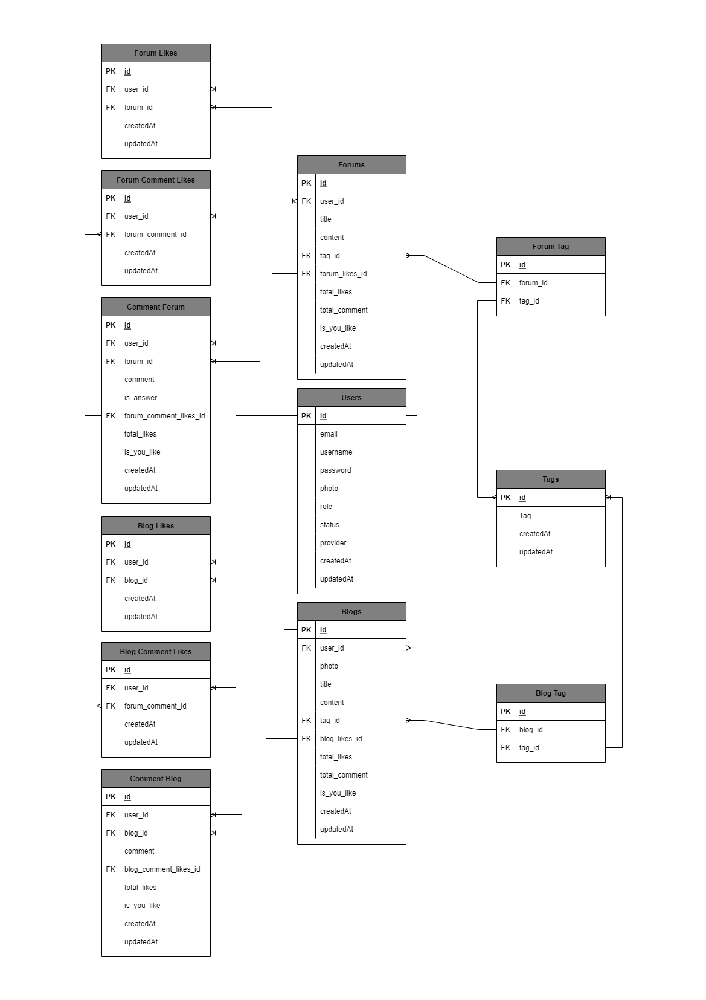

### Table of Contents

| [Tech Stack](#tech-stack) | [Entity Relationship Diagram](#entity-relationship-diagram) | [Architectural Pattern](#architectural-pattern) | [Swagger OpenAPI Docs](#swagger-openapi-docs) | [Server URL](#server-url) |
| :-----------------------: | :---------------------------------------------------------: | :---------------------------------------------: | --------------------------------------------- | ------------------------- |

## Tech Stack

[`^ kembali ke atas ^`](#table-of-contents)

- **Language:** [Go](https://golang.org/)
- **Framework:** [Gin](https://gin-gonic.com/)
- **Database:** [SQLite](https://www.sqlite.org), [RDS](https://aws.amazon.com/rds/)
- **Unit Testing:** [Ginkgo](https://github.com/onsi/ginkgo)
- **API Testing:** [Postman](https://www.getpostman.com/)
- **API Docs:** [Swagger](https://swagger.io/)
- **Deployment:** [EC2](https://aws.amazon.com/ec2/)
- **Object Cloud:** [S3](https://aws.amazon.com/s3/)
- **Code Editor:** [Visual Studio Code](https://code.visualstudio.com/)

## Entity Relationship Diagram

[`^ kembali ke atas ^`](#table-of-contents)

## Architectural Pattern

[`^ kembali ke atas ^`](#table-of-contents)

Architectural pattern yang digunakan adalah Clean Architecture, dimana aplikasi terbagi atas 4 layer, antara lain: **Domain/Entity**, **Use Case**, **Controller**, dan **Repository**. Dengan pola seperti ini, semua komponen aplikasi dapat dibuat secara independen sehingga mengurangi dependensi antar komponen dan dapat dikembangkan secara berkelanjutan.

## Swagger OpenAPI Docs

[`^ kembali ke atas ^`](#table-of-contents)

https://app.swaggerhub.com/apis/sultanfariz/Pinjem/1.0.0

## Server URL

[`^ kembali ke atas ^`](#table-of-contents)

http://be.codein.studio/api/v1